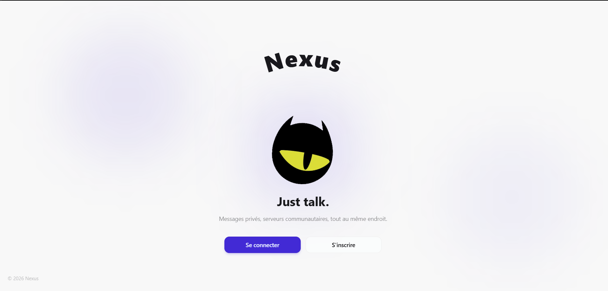
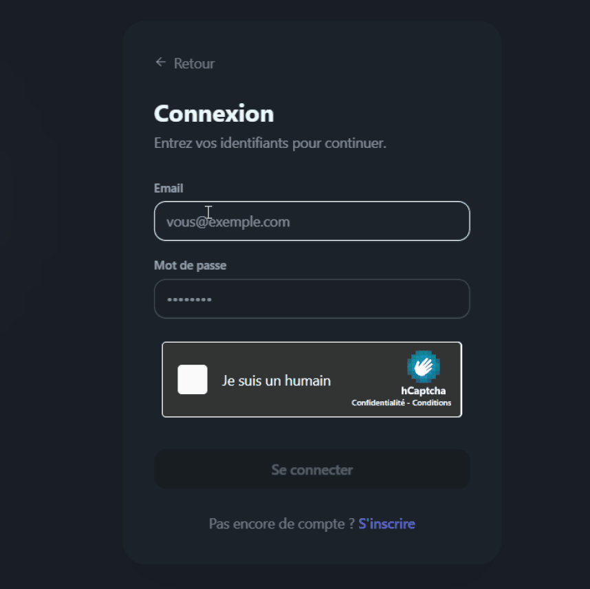
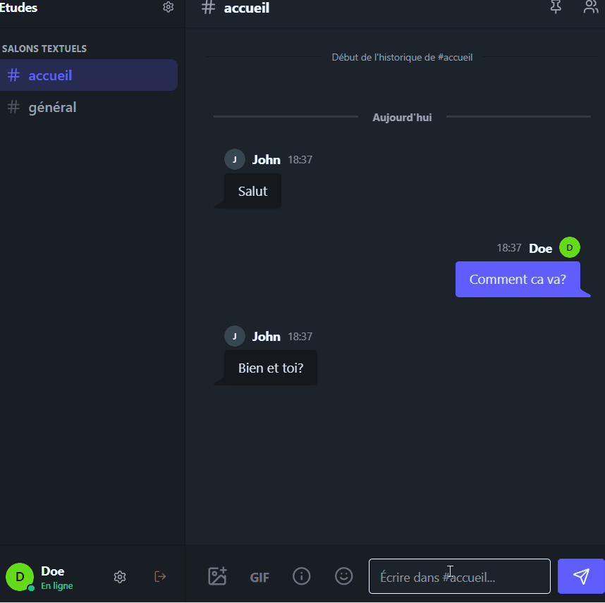
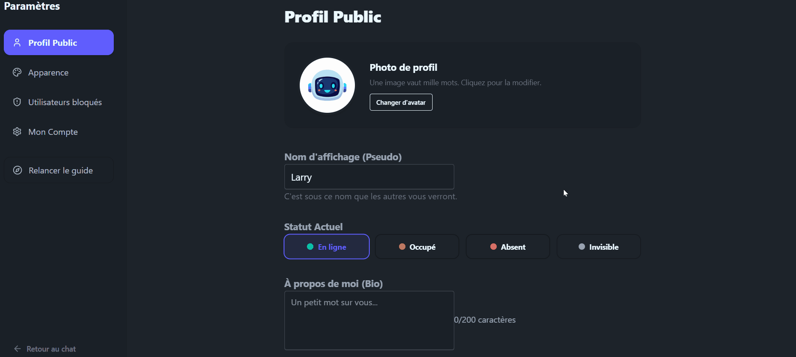
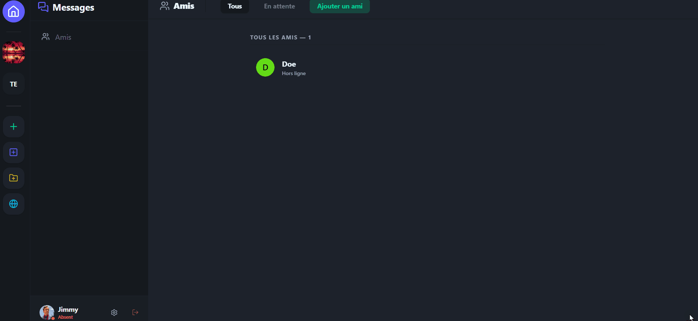

<div align="center">

  
  <h1>N E X U S</h1>
  
  <p><b>L'instinct de la communication. 
    <br />Simple . Fluide . Sécurisé . </b></p>

  <p>
    <a href="#"></a>
    <a href="#"></a>
    <a href="https://nexus-dusky-alpha.vercel.app"></a>
    <a href="https://opensource.org/licenses/MIT"></a>
  </p>

  <br />

  <a href="https://nexus-dusky-alpha.vercel.app" target="_blank">
    
  </a>

  <br /><br />

  <h2><a href="https://nexus-dusky-alpha.vercel.app"> Essayer maintenant</a></h2>
  <br />

  <p><i>Propulsé par les meilleures technologies web</i></p>

  <p>
    
    
    
    
    
  </p>

  <hr />
</div>

<br />

> **Nexus** est une plateforme de messagerie instantanée moderne, fluide et hautement sécurisée. Conçue pour offrir une alternative élégante et rapide aux outils de communication actuels, elle combine la puissance de React et de Supabase pour une expérience utilisateur sans compromis.

---

## ✨ Fonctionnalités Clés

### 💬 Communication & Social
- **Real-time Messaging** : Discussion instantanée avec mise à jour en direct via Supabase Realtime.
- **Gestion de Serveurs** : Créez vos propres espaces et organisez-les avec des salons thématiques.
- **Partage Multimédia** : Envoi d'images, intégration de GIFs via Giphy et gestion d'avatars personnalisés.
- **Quick Switcher** : Navigation ultra-rapide entre les serveurs et les messages privés.

### 🛡️ Sécurité & Protection
- **Authentification Sécurisée** : Système robuste géré par Supabase Auth.
- **Protection Anti-Bots** : Intégration complète de **hCaptcha** sur les flux de connexion et d'inscription.
- **Force du Mot de Passe** : Validation dynamique (8+ caractères, majuscules, chiffres, caractères spéciaux).
- **Zone de Danger** : Possibilité pour l'utilisateur de supprimer son compte et toutes ses données définitivement.

### 🎨 Design & Personnalisation
- **Multi-Thèmes** : Choisissez votre ambiance (Dark, Light, Cyberpunk, etc.) grâce à DaisyUI.
- **Interface Adaptive** : Entièrement responsive, de l'ordinateur de bureau au smartphone.
- **Micro-interactions** : Animations fluides et toasts de notification pour une UX premium.

---

## 📸 Aperçu de l'Interface (Démos)

| Connexion Sécurisée (hCaptcha) | Messagerie en Temps Réel |
| :--- | :--- |
|  |  |

| Paramètres | Navigation Rapide (Quick Switcher) |
| :--- | :--- |
|  |  |

---

## 🚀 Technologies Utilisées

| Secteur | Technologie |
| :--- | :--- |
| **Frontend** | [React.js](https://reactjs.org/) + [Vite](https://vitejs.dev/) |
| **Styling** | [Tailwind CSS](https://tailwindcss.com/) + [DaisyUI](https://daisyui.com/) |
| **Backend / DB** | [Supabase](https://supabase.com/) (PostgreSQL & Realtime) |
| **Sécurité** | [hCaptcha](https://www.hcaptcha.com/) |
| **Icônes** | [Lucide React](https://lucide.dev/) |
| **Déploiement** | [Vercel](https://vercel.com/) |

---

## 🛠️ Installation et Lancement

### 1. Pré-requis
Assurez-vous d'avoir [Node.js](https://nodejs.org/) installé sur votre machine.

### 2. Clonage et Dépendances
```bash
git clone https://github.com/votre-pseudo/nexus.git
cd nexus
npm install
```

### 3. Configuration des Variables d'Environnement
Créez un fichier `.env` à la racine du projet et ajoutez vos clés :
```env
VITE_SUPABASE_URL=votre_url_supabase
VITE_SUPABASE_ANON_KEY=votre_cle_anon
VITE_GIPHY_KEY=votre_cle_giphy
VITE_HCAPTCHA_SITE_KEY=votre_cle_publique_hcaptcha
```

### 4. Démarrage
Lancez le serveur de développement local :
```bash
npm run dev
```

---

## 📝 Licence

Ce projet est sous licence MIT. Libre à vous de l'utiliser et de le modifier.

---

